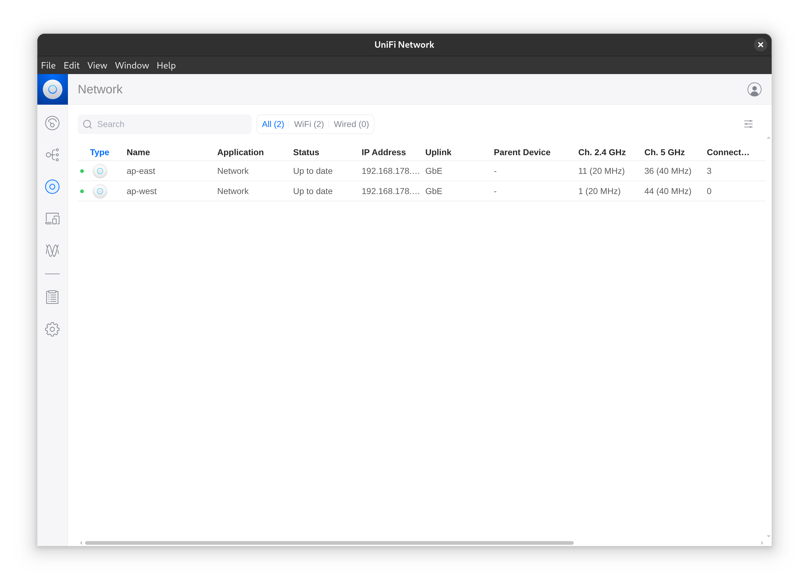

# Unifi Controller Desktop UI



An Electron-based desktop application that runs the [Unifi Controller](https://www.ui.com/software/) inside a container using [Podman](https://podman.io). It automatically starts and stops the container on application launch and exit, providing an ad-hoc management interface for Unifi devices.

---

## 🚀 Features

- Launches `lscr.io/linuxserver/unifi-controller` in the background using Podman
- Integrated GUI that waits until the controller is ready before connecting
- Configuration data is persisted in `~/.config/unifi-controller`
- Container stops automatically when the app exits
- Backup and restore of controller configuration is fully supported
- Unifi APs can reconnect and be managed even if the host's IP or hostname has changed since adoption (tested informally)

---

## 🧪 Project Background

This project is a **proof-of-concept** exploring the idea of running web-based applications on-demand via containerization with Podman, without requiring them to be permanently hosted on the network. 

This example aims to make hosting a Unifi Controller on a dedicated device redundant.  

---

## 🧱 Requirements

- **Podman** (must be installed and available in `PATH`)

Install Podman on Debian/Ubuntu:
```bash
sudo apt install podman
```

---

## 🛠 Development

### Clone and install dependencies
```bash
git clone https://github.com/youruser/unifi-controller-ui.git
cd unifi-controller-ui
npm install
```

### Run in development mode
```bash
npm start
```

---

## 📂 Data & Configuration

Configuration data is stored at:

```
~/.config/unifi-controller
```

To reset the controller, delete this directory.

You can safely use the controller's built-in **backup and restore** functionality to transfer or reset configurations.

---

## ⚠️ Known Issues & Limitations

- 🧊 **Deprecated container:** The `lscr.io/linuxserver/unifi-controller` image is no longer actively maintained. 
- 🔐 **TLS bypassed:** Electron is configured to ignore certificate errors, so the connection to the UI is not verified.
- 🧾 **Container permissions:** The controller writes configuration files as a user ID that may not exist on the host system. As a result, files under `~/.config/unifi-controller` may appear owned by a **dangling UID/GID** (i.e., an unknown user from the host's perspective).

And yes, this is mostly vibe-coded and I didn't even start to explore security considerations. Needless to say: This is not intended for production use. 
